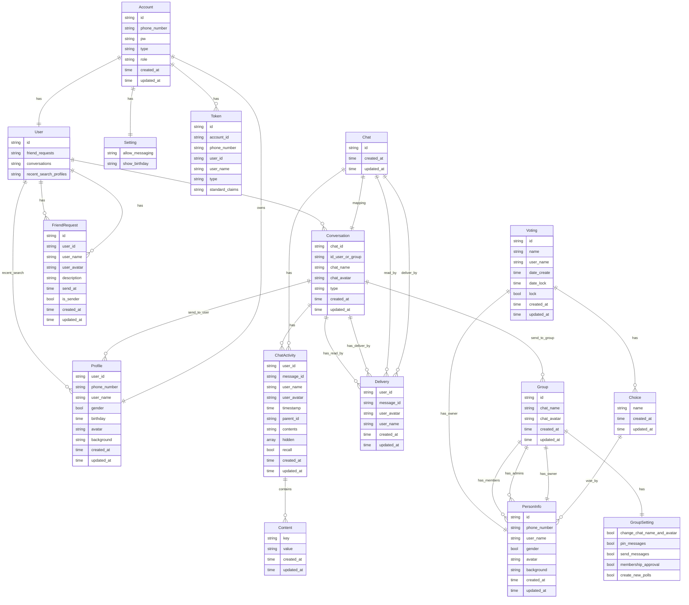

```mermaid
erDiagram
    Account {
        string id
        string phone_number
        string pw
        string type
        string role
        time created_at
        time updated_at
    }
    Profile {
        string user_id
        string phone_number
        string user_name
        bool gender
        time birthday
        string avatar
        string background
        time created_at
        time updated_at
    }
    User {
        string id
        string friend_requests
        string conversations
        string recent_search_profiles
    }
    Setting {
        string allow_messaging
        string show_birthday
    }
    Token {
        string id
        string account_id
        string phone_number
        string user_id
        string user_name
        string type
        string standard_claims
    }
    Conversation {
        string chat_id
        string id_user_or_group
        string chat_name
        string chat_avatar
        string type
        time created_at
        time updated_at
    }
    ChatActivity {
        string user_id
        string message_id
        string user_name
        string user_avatar
        time timestamp
        string parent_id
        string contents
        array hidden
        bool recall
        time created_at
        time updated_at
    }
    Content {
        string key
        string value
        time created_at
        time updated_at
    }
    Chat {
        string id
        time created_at
        time updated_at
    }
    Delivery {
        string user_id
        string message_id
        string user_avatar
        string user_name
        time created_at
        time updated_at
    }
    FriendRequest {
        string id
        string user_id
        string user_name
        string user_avatar
        string description
        time send_at
        bool is_sender
        time created_at
        time updated_at
    }
    Group {
        string id
        string chat_name
        string chat_avatar
        time created_at
        time updated_at
    }
    GroupSetting {
        bool change_chat_name_and_avatar
        bool pin_messages
        bool send_messages
        bool membership_approval
        bool create_new_polls
    }
    PersonInfo {
        string id
        string phone_number
        string user_name
        bool gender
        string avatar
        string background
        time created_at
        time updated_at
    }
    Choice {
        string name
        time created_at
        time updated_at
    }
    Voting {
        string id
        string name
        string user_name
        time date_create
        time date_lock
        bool lock
        time created_at
        time updated_at
    }

    Account ||--|| Profile : owns
    Account ||--|| User : has
    Account ||--|| Setting : has
    Account ||--o{ Token : has
    ChatActivity ||--o{ Content : contains
    Chat ||--o{ Delivery : deliver_by
    Chat ||--o{ Delivery : read_by
    Chat ||--o{ ChatActivity : has
    Chat ||--|| Conversation : mapping
    Choice ||--o{ PersonInfo : vote_by
    Conversation ||--o{ ChatActivity : has
    Conversation ||--o{ Delivery : has_deliver_by
    Conversation ||--o{ Delivery : has_read_by
    Conversation ||--o{ Group : send_to_group
    Conversation ||--o{ Profile : send_to_user
    Group ||--|| PersonInfo : has_owner
    Group ||--o{ PersonInfo : has_admins
    Group ||--o{ PersonInfo : has_members
    Group ||--|| GroupSetting : has
    User ||--o{ FriendRequest : has
    User ||--o{ FriendRequest : has
    User ||--o{ Conversation : has
    User ||--o{ Profile : recent_search
    Voting ||--|| PersonInfo : has_owner
    Voting ||--o{ Choice : has

```